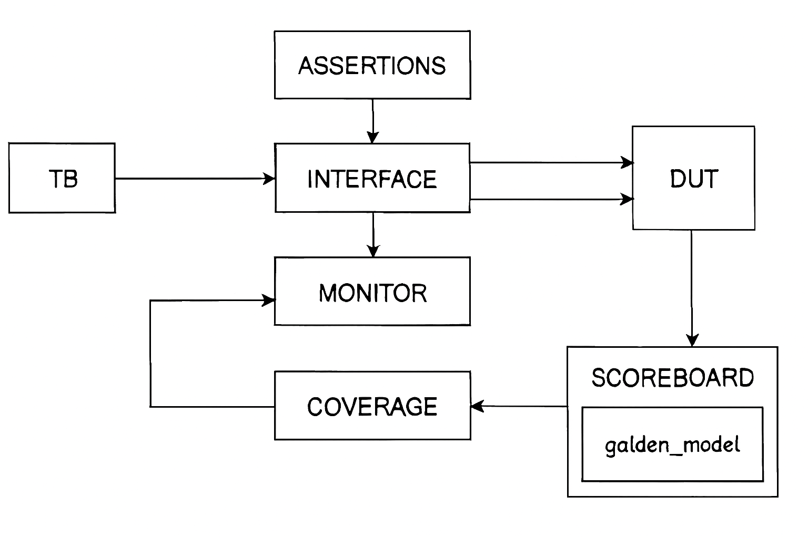

# 📡 SPI Slave Verification Environment (SystemVerilog + UVM)



## 📖 Overview
This project implements a **SystemVerilog/UVM verification environment** for a custom SPI Slave design.  
The environment validates the DUT (Device Under Test) using **transaction classes, randomized stimulus, coverage, scoreboards, assertions, and a golden reference model**.  

It demonstrates both **traditional SystemVerilog testbench architecture** and **UVM methodology**, making it a complete verification showcase.

---

## ⚙️ DUT Interface
The SPI Slave (`SLAVE`) module connects via `slave_if` interface:

**Inputs**
- `MOSI` – Master Out Slave In  
- `SS_n` – Slave Select (active low)  
- `clk` – Clock  
- `rst_n` – Active‑low reset  
- `tx_valid` – Transmit valid flag  
- `tx_data [7:0]` – Data to be transmitted  

**Outputs**
- `MISO` – Master In Slave Out  
- `rx_data [9:0]` – Received data buffer  
- `rx_valid` – Indicates valid received data  

---

## 🧪 Verification Components

### 1. **Transaction Class (`slave_transaction`)**
- Encapsulates DUT inputs/outputs.  
- Randomized with constraints on reset, SS_n, MOSI patterns, and tx_valid.  
- Implements `post_randomize()` to model protocol behavior (cycles, MOSI pointer).  

### 2. **Stimulus (tb)**
- Generates randomized transactions.  
- Drives signals into DUT via interface.  
- Triggers monitor sampling using `start_sampling` event.  

### 3. **Monitor**
- Samples DUT inputs/outputs.  
- Creates transaction objects.  
- Passes them to **Coverage** and **Scoreboard**.  
- Instantiates **Golden Model** for reference outputs.  

### 4. **Scoreboard**
- Compares DUT outputs (`rx_data`) against golden model reference.  
- Tracks `correct_count` and `error_count`.  
- Reports mismatches with detailed messages.  

### 5. **Coverage**
- Covergroup samples transaction activity.  
- Coverpoints:
  - `rx_data[9:8]` transitions  
  - `SS_n` timing (normal vs extended transactions)  
  - `MOSI` patterns (write addr, write data, read addr, read data)  
- Cross coverage ensures protocol combinations are exercised.  

### 6. **Assertions (SVA)**
- Properties bound to DUT check reset behavior and protocol correctness:
  - `MISO == 0` after reset  
  - `rx_valid == 0` after reset  
  - `rx_data == 0` after reset  
- Additional FSM transition checks included.  

### 7. **Golden Model**
- Behavioral model of SPI Slave.  
- Provides expected outputs for scoreboard comparison.  

### 8. **UVM Integration**
- UVM test (`slave_test`) configured via `uvm_config_db`.  
- Interface passed to UVM environment.  
- `run_test("slave_test")` executes UVM testbench.  

---

## ▶️ Simulation Instructions
1. Compile with QuestaSim/ModelSim:
   ```tcl
   vlog +define+SIM *.sv
   vsim top
   run -all
   ```
2. For UVM test:
   ```tcl
   vsim top -uvm
   run -all
   ```
3. Check assertion results in transcript.  
4. Generate coverage reports to confirm functional and assertion coverage.  

---

## 📊 Coverage Goals
- **Functional coverage**: All protocol patterns exercised.  
- **Assertion coverage**: Reset and FSM properties validated.  
- **Code coverage**: Achieved via QuestaSim reports.  

---

## ✨ Notes
- Randomized stimulus ensures wide protocol exploration.  
- Golden model provides cycle‑accurate reference outputs.  
- UVM integration demonstrates industry‑standard methodology.  
